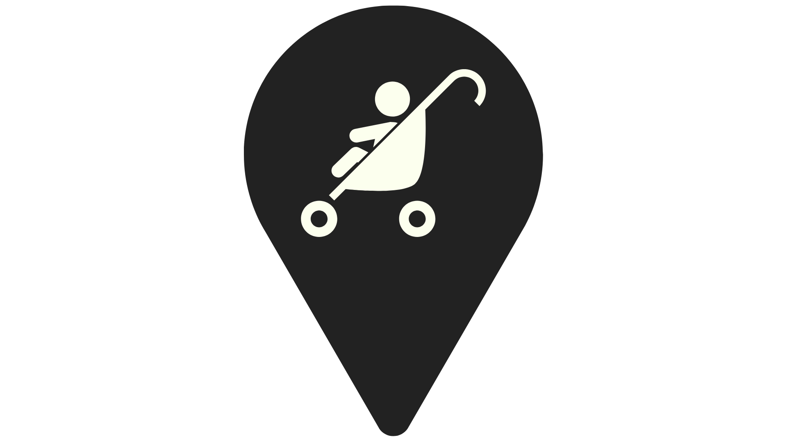

# Easyway
Easyway est une application pour aider les familles à trouver des lieux de sortie adaptées aux bébés et aux enfants en bas âge.

# Fonctionnalités
- Recommandations de lieux et transports adaptés
- Application participative où les utilisateurs peuvent :
  - ajouter des lieux
  - noter les lieux

# Configuration
- Rails 7
- Ruby
- Postgresql
- JS Stimulus
- HTML / CSS

# Installation sur un serveur en local
```
#=> installation des gems
bundle install

#=> création de la base de données
rails db:create

#=> création des tables
rails db:migrate

#=> création données dans les tables
rails db:seed

#=> lancement d'un serveur en local
rails s
```
Ensuite ouvrir le localhost dans un navigateur avec l'addresse indiquée dans le terminal.

# Contexte
Cette application a été développé en 2 semaines par une équipe de 4 personnes, dans le cadre de la formation "Concepteur développeur Web" de l'établissement de formation "Le Wagon".
